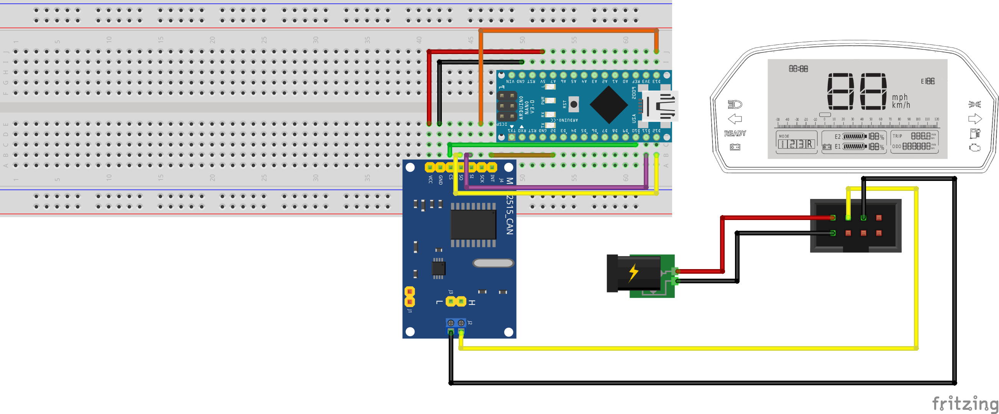

# Project Overview

This project demonstrates how to read CAN messages using an MCP2515 CAN controller and an Arduino. The code initializes the MCP2515, sets the bitrate, and reads CAN messages in a loop, printing the message details to the serial monitor.

## Requirements

- Arduino board
- MCP2515 CAN controller
- PlatformIO
- SPI library
- MCP2515 library

## Setup

1. Connect the MCP2515 to the Arduino using SPI.
2. Connect the MCP2515 to the CAN bus.
3. Load the code from `main.cpp` into the Arduino using PlatformIO.

A simple wiring diagram is shown below:

## Usage

1. Open the serial monitor in PlatformIO.
2. Set the baud rate to 115200.
3. Observe the CAN message details printed to the serial monitor.

## Code Overview

The main code is located in `main.cpp`. It performs the following steps:

1. Initializes the serial communication.
2. Resets the MCP2515 CAN controller.
3. Sets the bitrate to 500 Kbps.
4. Sets the MCP2515 to normal mode.
5. Reads CAN messages in a loop and prints the message ID, DLC, and data to the serial monitor.
